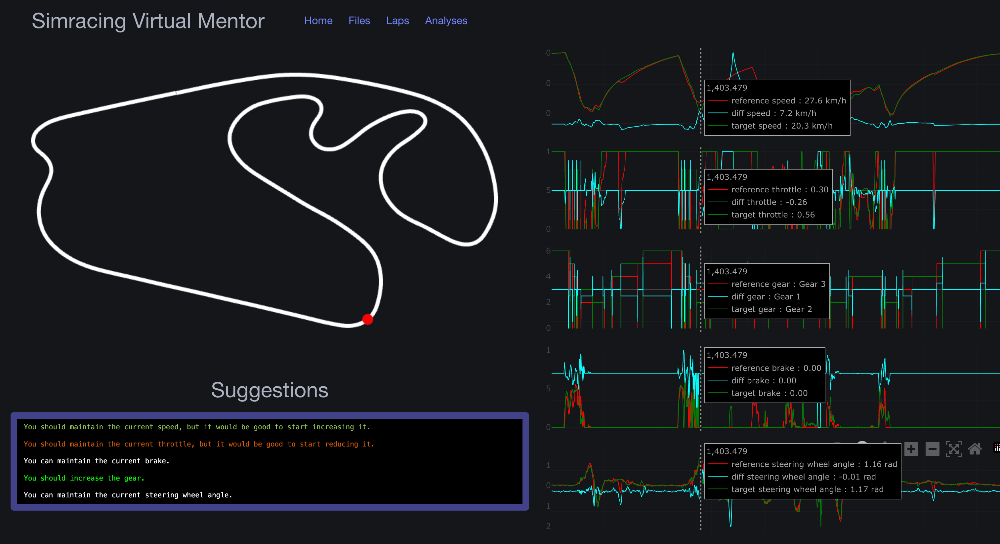

# Simracing Virtual Mentor
[](https://github.com/AdriRRP/simracing-virtual-mentor/actions/workflows/clippy.yaml) [](https://github.com/AdriRRP/simracing-virtual-mentor/actions/workflows/tests.yaml) [](https://codecov.io/gh/AdriRRP/simracing-virtual-mentor)

**Asistente Virtual para Simulación de Conducción Deportiva: Un Enfoque de Telemetría Comparativa**



## Tabla de Contenidos

1. [Acerca del Proyecto](#about-the-project)
2. [Características](#features)
3. [Instalación](#installation)
4. [Uso](#usage)
5. [Estructura de Directorios](#directory-structure)
6. [Cómo Contribuir](#contributing)
7. [Licencia](#license)
8. [Agradecimientos](#acknowledgements)

## Acerca del Proyecto

Este repositorio aloja mi proyecto final para el grado en Ingeniería Informática en la [Escuela Superior de Informática (ESI) de Ciudad Real](https://esi.uclm.es), [Universidad de Castilla la Mancha](https://www.uclm.es), España.

El objetivo de este proyecto es desarrollar un asistente virtual para usuarios de iRacing que les permita comparar sus rendimientos por vuelta en diversos circuitos. Aprovechando los datos de telemetría, el asistente proporciona a los usuarios comentarios en lenguaje natural y gráficos comparativos detallados de variables críticas de telemetría, lo que ayuda a mejorar los tiempos por vuelta.

El proyecto está desarrollado íntegramente en Rust, cubriendo tanto el frontend como el backend, y muestra un enfoque integral para el desarrollo full-stack. Además, integra modelos avanzados de aprendizaje automático para agrupar las diferencias entre las vueltas comparadas, proporcionando información sobre el rendimiento de conducción.

El proyecto está organizado utilizando los principios de Diseño Guiado por Dominios (DDD), lo que garantiza una arquitectura modular y escalable que puede mantenerse y ampliarse fácilmente.

## Características

- **Análisis de Telemetría**: Compara los rendimientos por vuelta analizando datos clave de telemetría.
- **Comentarios en Lenguaje Natural**: Recibe información y sugerencias en un lenguaje natural fácil de entender.
- **Comparaciones Gráficas**: Visualiza variables críticas de telemetría a través de gráficos comparativos.
- **Desarrollo Full-Stack en Rust**: Desde el backend hasta el frontend, el proyecto está construido íntegramente en Rust.
- **Aprendizaje Automático Avanzado**: Utiliza modelos de aprendizaje automático para agrupar las diferencias entre las vueltas comparadas.

## Instalación

### Requisitos Previos

- [Docker](https://www.docker.com/get-started) instalado en su sistema.
- Se recomienda tener conocimientos básicos de Rust y Docker.

### Configuración

1. **Clonar el repositorio:**
    ```bash
    git clone https://github.com/AdriRRP/simracing-virtual-mentor.git
    cd simracing-virtual-mentor
    ```
2. **Construir y ejecutar la aplicación usando Docker Compose:**
    ```bash
    docker-compose up --build
    ```
   Esto configurará la base de datos MongoDB e iniciará los servicios de backend y frontend.

3. **Acceder a la aplicación:**
   Una vez que los servicios estén en ejecución, el frontend debería ser accesible en http://localhost:8000.

## Uso

1. **Carga de Archivos de Telemetría:**
   - Carga tus archivos de telemetría de iRacing a través de la interfaz de frontend.

2. **Análisis de Vueltas:**
   - Selecciona las vueltas a comparar. El sistema proporcionará comentarios y un análisis gráfico.

3. **Revisión de Resultados:**
   - Visualiza los resultados detallados del análisis, incluidos gráficos y sugerencias, para mejorar tus tiempos por vuelta.

## Estructura de Directorios

El proyecto está organizado con un enfoque en la claridad y la mantenibilidad, cumpliendo con los principios de Diseño Guiado por Dominios (DDD) y la arquitectura hexagonal. A continuación se presenta una visión general de la estructura de directorios y su propósito:

**Directorios de Nivel Superior**

- **`app/`**: Contiene todo el código de la aplicación, dividido en tres módulos principales: `shared`, `backend` y `frontend`.

- **`docs/`**: Incluye el informe del proyecto y otra documentación relevante. Esto es esencial tanto para el desarrollo como para la presentación final del proyecto.

- **`etc/`**: Almacena archivos de configuración y scripts adicionales. Esto incluye el script de inicialización de MongoDB y otras configuraciones específicas del entorno.

- **`.github/`**: Contiene los flujos de trabajo de GitHub Actions para integración y despliegue continuos (CI/CD). Esto garantiza que el código se pruebe, compile y despliegue automáticamente.


## Cómo Contribuir

¡Las contribuciones son bienvenidas! Por favor, sigue estos pasos:

1. Haz un fork del proyecto.
2. Crea tu rama de funcionalidad (`git checkout -b feature/AmazingFeature`).
3. Haz commit de tus cambios (`git commit -m 'Add some AmazingFeature'`).
4. Haz push a la rama (`git push origin feature/AmazingFeature`).
5. Abre un pull request.

### Trabajar en Problemas (Issues)

Si buscas algo en qué contribuir, revisa la sección de [problemas abiertos](https://github.com/AdriRRP/simracing-virtual-mentor/issues). ¡Hay una variedad de tareas, informes de errores y mejoras que podrían necesitar tu ayuda!

No dudes en comentar cualquier problema en el que te gustaría trabajar, y con gusto lo asignaré. Si tienes alguna pregunta o necesitas mayor aclaración, no dudes en preguntar en el issue o contactarme a través de un pull request.

### Directrices

- Asegúrate de que tu código siga la guía de estilos y cuente con comentarios y documentación adecuados.
- Intenta incluir pruebas para nuevas funcionalidades o actualizaciones de las existentes.
- Asegúrate de que el proyecto se compile sin errores antes de enviar tu pull request.
- Si estás corrigiendo un error, por favor referencia el número del issue en tu mensaje de commit (por ejemplo, `Fixes #123`).

Agradecemos tus esfuerzos por mejorar el proyecto y esperamos tus contribuciones.


## Licencia

Distribuido bajo la Licencia GPL-3.0. Consulte [LICENSE](LICENSE) para más información.

## Agradecimientos

- [Escuela Superior de Informática (ESI)](https://esi.uclm.es)
- [Universidad de Castilla la Mancha](https://www.uclm.es)
- [Lenguaje de Programación Rust](https://www.rust-lang.org)
